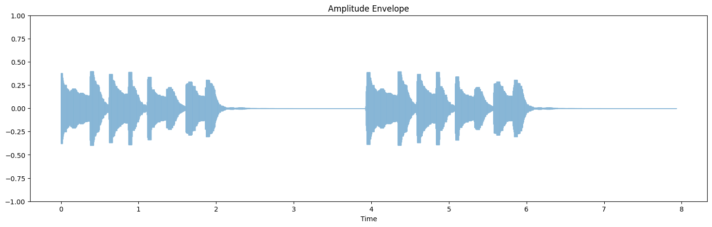
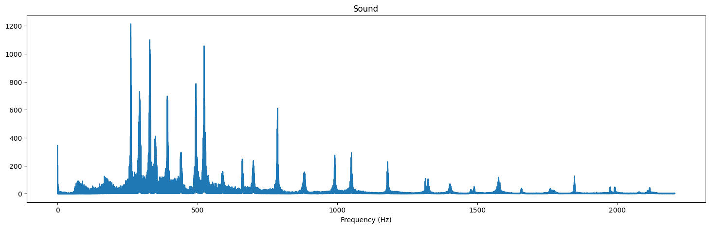
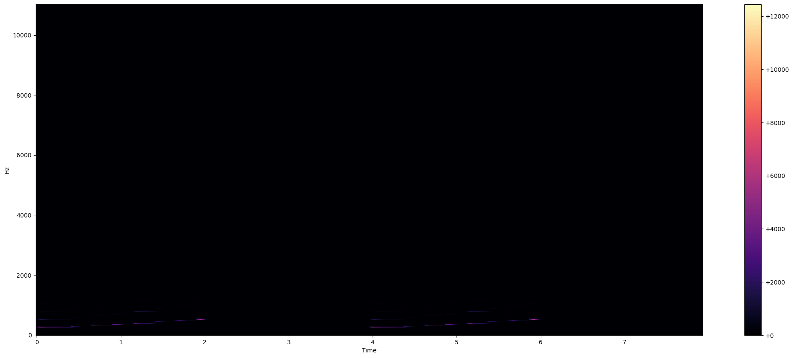
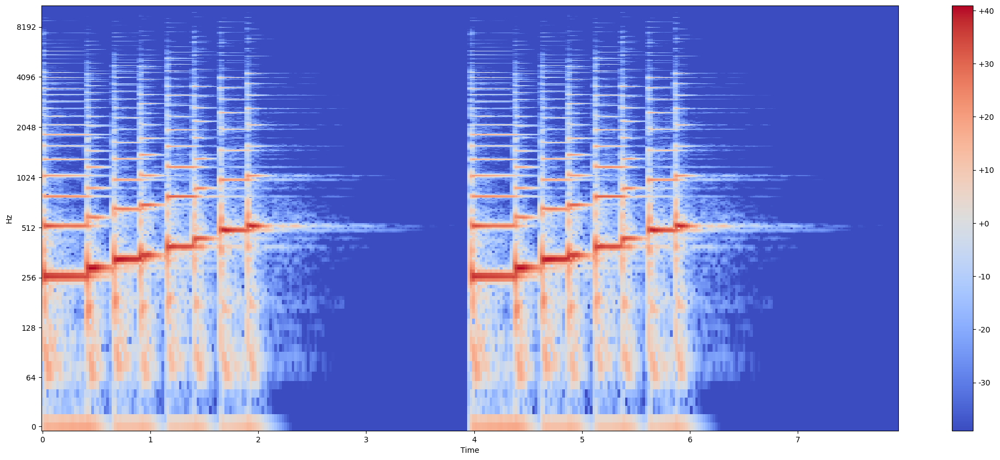
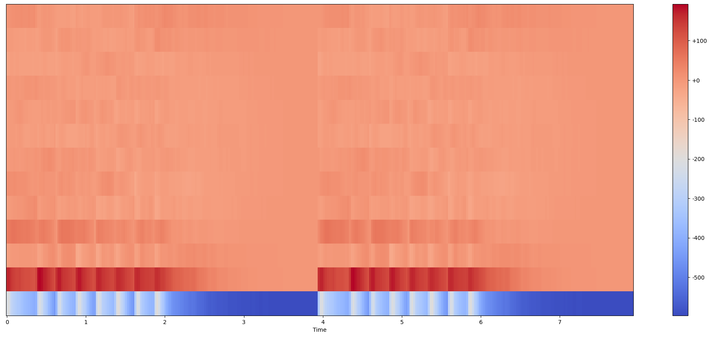

# Acoustic Features

## Task 1

Task 1 的要求是根据音频文件的时域波形图，绘制出振幅包络线。

根据包络线的定义，可以给出如下函数：

```python
# Task 1
def amplitude_envelope(signal, frame_size, hop_length) -> np.ndarray:
    """Calculate the amplitude envelope of a signal with a given frame size and hp_length."""
    # Hint: recall the definition of amplitude_envelope
    envelop = np.zeros(len(signal))
    for i in range(0, len(signal), hop_length):
        # 取每一帧的最大值
        envelop[i] = np.max(signal[i:i + frame_size])
    return envelop


# test amplitude_envelope
envelop = amplitude_envelope(sound, 1024, 128)
plt.figure(figsize=(18, 5))
librosa.display.waveshow(envelop, alpha=0.5)
plt.ylim((-1, 1))
plt.title("Amplitude Envelope")
```



## Task 2

Task 2 的要求是绘制音频文件的频谱图。

按照提示，计算FFT后，取绝对值即可。

```python
# Task 2
# Visualising audio signal in the frequency domain
def plot_magnitude_spectrum(signal, sr, title, f_ratio=1):
    """Time domain -> Frequency domain"""
    # Hint: calculate the FT of signal, then calculate the absolute value to get magnitude
    ft = np.fft.fft(signal)
    magnitude = np.abs(ft)

    X_mag = magnitude[:int(len(magnitude) / f_ratio)]

    # make a plot
    plt.figure(figsize=(18, 5))

    f = np.linspace(0, sr, len(X_mag))
    f_bins = int(len(X_mag) * f_ratio)

    plt.plot(f[:f_bins], X_mag[:f_bins])
    plt.xlabel('Frequency (Hz)')
    plt.title(title)

plot_magnitude_spectrum(sound, sr, "Sound", 0.1)
```



## Task 3

Task 3 的要求是绘制音频文件的频谱图。

```python
# Task 3
def plot_spectrogram(Y, sr, hop_length, y_axis="linear"):
    """Visualizing the spectrogram"""
    plt.figure(figsize=(25, 10))
    # Hint: y_axis choice: "linear", "log"
    # Hint: use librosa.display.specshow()
    librosa.display.specshow(Y, y_axis=y_axis, x_axis="time", sr=sr)
    plt.colorbar(format="%+2.0f dB")
    plt.title("Spectrogram")
    plt.show()
```




## Task 4

Task 4 的要求是绘制音频文件的 MFCC 图。

```python

# Task 4
# Visualising MFCCs
def plot_mfccs(Y, sr, n_mfcc=13):
    # Hint: extract mfccs, use librosa.feature.mfcc()
    mfccs = librosa.feature.mfcc(Y, sr=sr, n_mfcc=n_mfcc)

    plt.figure(figsize=(25, 10))
    librosa.display.specshow(mfccs, x_axis="time", sr=sr)
    plt.colorbar(format="%+2.f")
    plt.show()
```

